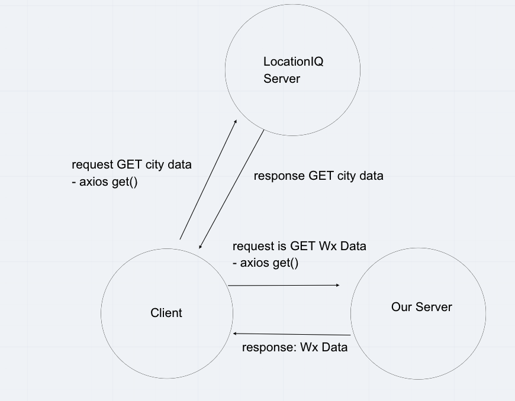

# City Explorer API - 4/10/2021   

**Author**: Wenhao Piao   
**Keyword**: Express    
**Version**: 1.0.0    

## Overview
This app is an express server that responses to clients' requests.

## Getting Started    
1. Clone the repo.    
2. `npm i` to install all required dependencies.      
3. `npm start` to start the server.   

## Architecture
* express   
* cors    
* dotenv
* Heroku

## Change Log
It took me 1 hour to complete this lab including add features in the front-end.

## Credit and Collaborations
* Collaborator - Lorenzo Ortega 
* Web request-response cycle diagram   
   

## References   
[Express](https://expressjs.com/en/starter/hello-world.html)    
[NPM Cors](https://www.npmjs.com/package/cors)    
[NPM dotenv](https://www.npmjs.com/package/dotenv)    

## Live Site URL    
* [City Explorer Front-end](https://affectionate-snyder-4a925f.netlify.app/)
* [City Explorer Back-end](https://city-explorer-api-wp.herokuapp.com/)
